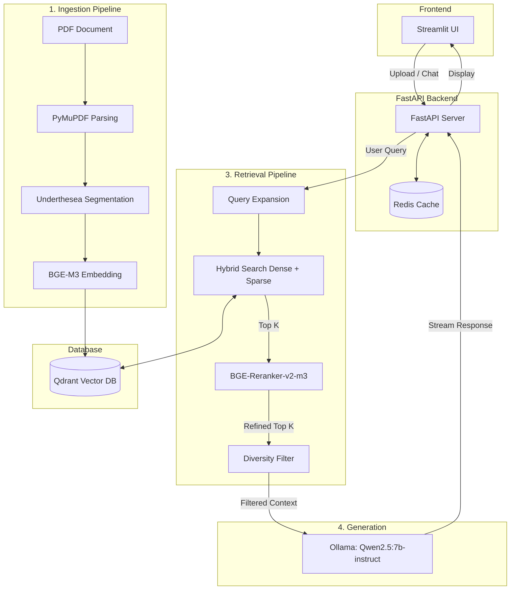
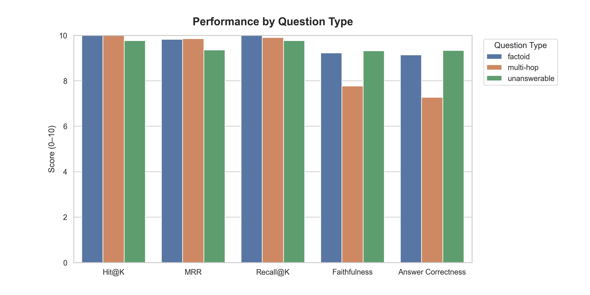
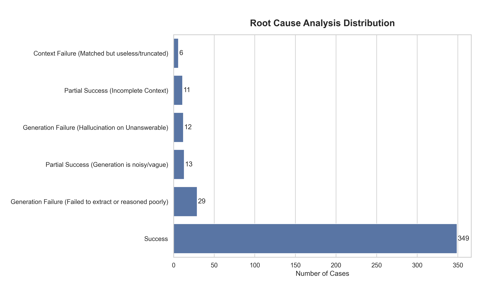
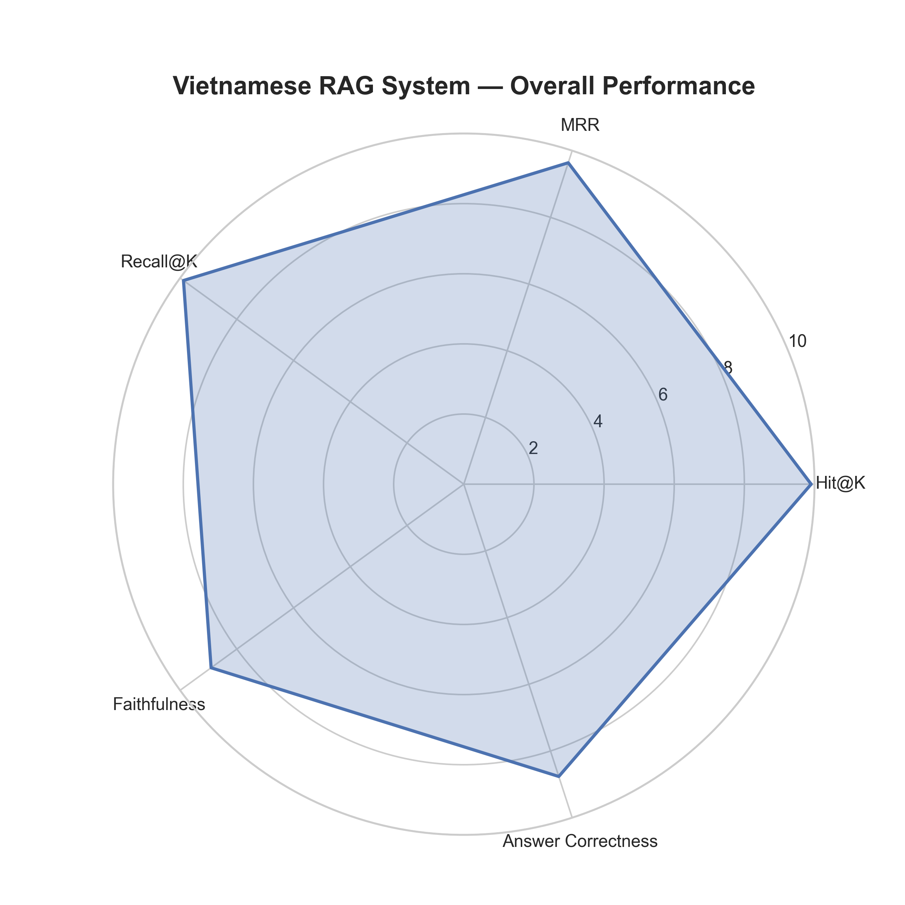

# 🇻🇳 Vietnamese RAG System (Production-Ready)


> Một hệ thống Retrieval-Augmented Generation (RAG) hướng tới môi trường production, được thiết kế với sự cân nhắc rõ ràng giữa chất lượng truy xuất, độ trễ và khả năng đánh giá.

---

## Demo
<p align="center">
  
</p>

---
## Features

- Tìm kiếm lai (dense + sparse) với Reciprocal Rank Fusion (RRF)
- Mở rộng truy vấn để chuẩn hóa tiếng Việt (chữ hoa/thường, loại bỏ dấu câu)
- Xếp hạng lại bằng cross-encoder (BGE-Reranker) nhằm tối ưu hóa độ chính xác
- Lọc đa dạng ngữ nghĩa để loại bỏ các ngữ cảnh trùng lặp
- Luồng xử lý bất đồng bộ FastAPI với khả năng streaming phản hồi (streaming responses)
- Bộ nhớ đệm (cache) dựa trên Redis với cơ chế exact-match giúp giảm thiểu độ trễ
- Đánh giá bằng phương pháp LLM-as-a-judge kết hợp phân tích nguyên nhân gốc rễ tự động

## System Architecture & Workflow

Hệ thống được xây dựng bằng **FastAPI** (backend) và **Streamlit** (frontend), tích hợp các luồng công việc cốt lõi sau:

1. **Ingestion (`src/ingestion`)**: Phân tích cú pháp (parse) các file PDF bằng `PyMuPDF`. Thay vì chia token tiêu chuẩn, hệ thống áp dụng phương pháp chia nhỏ theo cấu trúc (structural chunking) với các giới hạn về độ dài và độ chồng chéo (overlapping). Văn bản tiếng Việt được phân đoạn từ (segmentation) bằng `underthesea` để có độ chính xác nhúng (embedding) tốt hơn.
2. **Vector Store (`src/ingestion/vector_store.py`)**: Quản lý bất đồng bộ các vector nhúng của tài liệu trong **Qdrant**. Tính toán cả vector dày đặc (dense vectors) và trọng số từ vựng thưa (sparse lexical weights) sử dụng mô hình `BGE-M3`.
3. **Retrieval (`src/retrieval`)**: 
   - **Query Expansion (Mở rộng truy vấn):** Chuẩn hóa và mở rộng truy vấn của người dùng.
   - **Hybrid Search (Tìm kiếm lai):** Thực thi tìm kiếm đồng thời trên Qdrant sử dụng kỹ thuật Reciprocal Rank Fusion (RRF) để kết hợp kết quả dense và sparse.
   - **Reranking & Filtering (Xếp hạng lại & Lọc):** Sử dụng `bge-reranker-v2-m3` để chấm điểm các ứng cử viên hàng đầu, theo sau là Bộ lọc Đa dạng Cosine-Similarity (Cosine-Similarity Diversity Filter) tự phát triển để loại bỏ các đoạn ngữ cảnh dư thừa về mặt ngữ nghĩa.
4. **Generation (`src/generation`)**: Xây dựng các prompt nhận thức ngữ cảnh (context-aware) kết hợp bảo vệ độ dài văn bản. Stream câu trả lời qua **Ollama** đang chạy mô hình `Qwen2.5:7b-instruct`.
5. **Caching (`src/core/cache.py`)**: Dùng **Redis** để lưu đệm các phản hồi LLM và quản lý trạng thái các tác vụ ngầm bất đồng bộ (ví dụ: tiến độ tải lên file).



## Key Design Insights

Hệ thống này không chỉ đơn giản là một bản triển khai RAG thông thường — nó được xây dựng dựa trên một vài quan sát vô cùng quan trọng sau:

- **Chỉ dùng tìm kiếm lai (Hybrid retrieval) là không đủ**  
  → Dense + sparse cải thiện độ phủ (recall), nhưng lại đưa thêm nhiều nhiễu ngữ nghĩa.

- **Xếp hạng lại (Reranking) là bắt buộc, không phải là tùy chọn**  
  → Việc reranking bằng cross-encoder cải thiện độ chính xác một cách vô cùng đáng kể, dù có làm tăng độ trễ (O(N)).

- **Sự trùng lặp là một điểm nghẽn tiềm ẩn**  
  → Các phần văn bản được truy xuất về thường chứa những thông tin chồng chéo lên nhau → được giải quyết qua bộ lọc đa dạng độ tương đồng Cosine.

- **Cơ chế cache exact-match hoạt động hiệu quả ngoài mong đợi**  
  → Đối với tác vụ hỏi đáp tài liệu, các truy vấn bị lặp lại xảy ra rất thường xuyên → phương pháp hashing đơn giản mang lại tỷ suất hoàn vốn (ROI) rất cao.

- **Khâu đánh giá (Evaluation) cần phải được bóc tách riêng biệt**  
  → Các khâu truy xuất (retrieval) và khâu sinh văn bản (generation) được đánh giá độc lập với nhau để định vị chính xác đâu mới là điểm gây ra lỗi.

## Tech Stack

- **Backend:** FastAPI, Python `asyncio`
- **Frontend:** Streamlit
- **Vector Database:** Qdrant (Async Client)
- **Caching:** Redis
- **Models:** BAAI/bge-m3 (Embedding), BAAI/bge-reranker-v2-m3 (Reranking), Qwen2.5:7b-instruct (Sinh văn bản qua Ollama)
- **NLP:** Underthesea (Phân đoạn từ tiếng Việt)

## What This System Gets Right

- Phân tách rạch ròi chất lượng của truy xuất (retrieval) và sinh văn bản (generation)
- Áp dụng reranking để sửa chữa lượng nhiễu do thuật toán tìm kiếm lai sinh ra
- Xử lý tốt khâu tiền xử lý đặc trưng cho tiếng Việt (phân đoạn từ + chuẩn hóa)
- Triển khai kỹ thuật streaming bất đồng bộ giúp trải nghiệm UX tốt hơn rất nhiều
- Tích hợp một luồng đánh giá toàn diện đi kèm cơ chế tự chẩn đoán lỗi (không đơn thuần chỉ xuất ra các điểm số)

## Installation

### Prerequisites
- [uv](https://docs.astral.sh/uv/) (Rất khuyến khích sử dụng)
- Docker (dành cho Qdrant và Redis)
- [Ollama](https://ollama.com) cài đặt ngay trên máy local.
- Python 3.12+ (được quản lý bởi `uv`)

### Setup Steps

1. **Di chuyển vào thư mục dự án:**
   ```bash
   cd vietnamese-rag-system
   ```

2. **Cài đặt các gói phụ thuộc (Dependencies):**
   Với công cụ `uv`, tất cả các dependencies và môi trường ảo sẽ được tự động quản lý:
   ```bash
   uv sync
   ```

3. **Khởi chạy các dịch vụ bắt buộc:**
   Đảm bảo Docker và Ollama đã được bật, sau đó tiến hành tải các mô hình cục bộ:
   ```bash
   # Chạy Qdrant thông qua Docker Compose (khuyên dùng để giữ được tính bền vững của dữ liệu)
   docker compose up -d
   
   # Chạy Redis thông qua Docker
   docker run -d -p 6379:6379 redis
   
   # Kéo (pull) mô hình LLM về máy
   ollama pull qwen2.5:7b-instruct
   ```

4. **Cấu hình biến môi trường (Environment Configuration):**
   Tạo file `.env` ở thư mục gốc dự án (vui lòng tham khảo bộ mẫu bên dưới):
   ```env
   QDRANT_HOST="localhost"
   QDRANT_PORT=6333
   REDIS_URL="redis://localhost:6379"
   OLLAMA_BASE_URL="http://localhost:11434/api/chat"
   LLM_MODEL_NAME="qwen2.5:7b-instruct"
   GEMINI_API_KEY="your_api_key_for_evaluation"
   ```

## Usage

1. **Khởi động Backend FastAPI:**
   ```bash
   uv run uvicorn src.api.main:app --host 0.0.0.0 --port 8000
   ```

2. **Khởi động Frontend Streamlit (tại một cửa sổ terminal mới):**
   ```bash
   uv run streamlit run src/ui/streamlit_app.py
   ```

3. **Truy cập Giao diện Web (Web UI):**
   Hãy mở đường dẫn [http://localhost:8501](http://localhost:8501) bằng trình duyệt để tải file PDF lên và bắt đầu truy vấn.

## 🏆 AI-Guru Competition: Submission Pipeline

Hệ thống đã được thiết kế lại để tuân thủ 100% quy chế cuộc thi AI-Guru (không sử dụng API đóng như Gemini/OpenAI, chỉ dùng model Local + Open Source dưới 14B tham số).

Để tạo file `results.json` và file nén `submission.zip` dùng để nộp cho Ban Tổ Chức, bạn hãy sử dụng tập lệnh `generate_submission.py`.

### Quick Test (1-2 questions)
Mình đã tạo sẵn file `test_2_cau.json` chứa 2 câu hỏi mẫu để bạn có thể chạy thử nghiệm toàn bộ luồng xử lý mà không cần phải chờ đợi quá lâu:
```bash
uv run generate_submission.py --dataset test_2_cau.json --output test_results.json
```
Câu lệnh trên sẽ in ra log chi tiết quá trình Retrieve & Generate, sau đó tự động khởi tạo file `test_results.json` và nén lại thành `submission.zip` để bạn dễ dàng kiểm tra định dạng dữ liệu đầu ra.

### Full Dataset Run
Để chạy thật sự trên toàn bộ bộ câu hỏi chính thức của BTC (2001 câu):
```bash
uv run generate_submission.py --dataset "..\R2AIStage1DATA.json" --output results.json --collection "Dataset_Hybrid_BGE_M3_BM25_V1"
```
*Lưu ý: Quá trình này sẽ ngốn khá nhiều thời gian. Script này đã được tích hợp sẵn cơ chế Checkpoint (Sao lưu tự động): giả sử máy tính bị mất điện hoặc bạn nhấn tổ hợp phím Ctrl+C để dừng lại ngang chừng, lần sau khi bạn gõ lại lệnh trên, script sẽ thông minh tự động tiếp tục công việc tại đúng câu hỏi bị ngắt quãng mà không cần phải thực hiện lại từ điểm xuất phát ban đầu.*

## Evaluation & Benchmarks

Để đảm bảo hệ thống có độ tin cậy cao khi áp dụng vào các tác vụ thực tiễn, chúng tôi đã tích hợp một luồng đánh giá **LLM-as-a-Judge** vô cùng toàn diện (`src/evaluation/evaluator.py`). 

### Dataset
Quá trình đánh giá được thực thi trên một tập dữ liệu **Vietnamese Legal QA Dataset** tùy chỉnh, chứa đựng đa dạng các dạng câu hỏi khác nhau bao gồm cả những câu hỏi không thể nào trả lời được nhằm thử thách khả năng kháng "ảo giác" (hallucination resistance) của hệ thống.
- Tập dữ liệu này đã được embed và lưu trữ trực tiếp phía trong **Qdrant Vector DB** (cụm collection `Dataset_Hybrid_BGE_M3_BM25_V1`).
- Trong xuyên suốt pha truy xuất thông tin, hệ thống tiến hành query chọc thẳng vào Qdrant nhằm đảm bảo một môi trường đánh giá cục bộ 100% hoàn toàn độc lập mà không bị ràng buộc bởi các API service bên ngoài.

### Evaluation Methodology
Kiến trúc luồng xử lý sẽ chấm điểm tách bạch hoàn toàn bộ phận **Retriever** (Trình truy xuất) và bộ phận **Generator** (Trình sinh đáp án) để dễ dàng chẩn bệnh chính xác các điểm thắt cổ chai, chứ không đơn thuần chỉ là vứt cho mỗi một con điểm số vào đáp án cuối cùng.

1. **Semantic Retrieval Evaluation (Đánh giá chất lượng truy xuất mặt ngữ nghĩa):** Thay vì áp dụng phương pháp so khớp chuỗi (exact-string matching) vô cùng cứng nhắc và kém hiệu quả, chúng tôi tận dụng Cross-Encoder (`bge-reranker-v2-m3`) nhằm cân đo đong đếm độ tương đồng ngữ nghĩa giữa những mẩu thông tin vừa truy xuất về so với bối cảnh chuẩn (Ground Truth).
   - **Metrics:** `Hit@K`, `MRR` (Mean Reciprocal Rank), `Recall@K`.

2. **Grounded Generation Evaluation (LLM Judge):** Chúng tôi chiêu mộ `gemini-2.5-flash` kèm theo một đoạn prompt chấm thi cực kì gắt gao (Chấm theo thang điểm 0-10) để phân phó đóng vai trò như một vị giám khảo khách quan và công tâm.
   - **Faithfulness (Mức độ trung thực):** Đong đếm thử xem lời giải đáp vừa được sinh ra có bám sát chặt chẽ theo những ngữ cảnh được cung cấp hay không (trừ điểm thẳng tay đối với các trường hợp chém gió ảo giác).
   - **Answer Correctness (Độ chính xác của đáp án):** Đo lường tính đúng đắn về mặt ngữ nghĩa trong cách giải quyết vấn đề của câu trả lời so với chuẩn Ground Truth.
   - **Abstention Accuracy (Tỉ lệ từ chối trả lời chính xác):** Đánh giá mức độ nhạy bén của hệ thống trong việc thật thà thú nhận "Tôi không biết" khi bị dồn vào chân tường bởi những câu truy vấn nằm ngoài phạm vi vùng phủ sóng của ngữ cảnh.

3. **Automated Root Cause Analysis - RCA (Cơ chế Phân tích nguyên nhân lỗi tự động):**
   Luồng xử lý vượt qua giới hạn của những báo cáo số liệu vô tri bằng việc tự động nhận diện và phân chia các loại lỗi hỏng hóc. Lấy ví dụ, nếu một câu truy vấn bị thất bại, lập tức hệ thống sẽ tự mình khám phá ra căn bệnh gốc rễ:
   - *Retrieval Failure:* Ngữ cảnh thông tin then chốt đã hoàn toàn mất tích, không hề có mặt trong bảng xếp hạng Top-K kết quả.
   - *Context Failure:* Ngữ cảnh dẫu đã được triệu hồi thành công thế nhưng lại bị đứt đoạn quá đà hoặc chứa quá nhiều "cặn bã" gây nhiễu loạn.
   - *Generation Failure:* Dù cho đã bưng mâm ngữ cảnh hoàn hảo lên tận miệng, thế mà mô hình LLM vẫn bất lực trong việc chiết xuất đáp án hoặc tệ hơn là tự động "phát minh" ra một chân lý giả tạo.

## 📊 Evaluation Results

<p align="center">
  
</p>

<p align="center">
  
</p>

<p align="left">
  
</p>

## Known Limitations

- Khâu Reranking ứng dụng mô hình cross-encoder làm gia tăng độ trễ cho hệ thống (Độ phức tạp O(N) tùy theo số lượng các tài liệu ứng cử viên)
- Khuyết thiếu bộ lưu đệm ngữ nghĩa Semantic caching (tạm thời chỉ mới hỗ trợ cache dạng exact-match)
- Các tiến trình BackgroundTasks chạy nền vẫn chưa được trang bị cơ chế tự phục hồi lỗi (thiếu vắng kiến trúc hàng đợi queue / logic retry khi hỏng hóc)
- Hiệu suất tổng thể vẫn chưa được chạy kiểm thử benchmark đối với các bài toán chịu tải đồng thời (high concurrency) 
- Rào cản giới hạn về kích thước context window (độ dài cửa sổ ngữ cảnh) đôi khi sẽ chặt cụt đi các tài liệu có độ dài khủng

> Những khuyết điểm đánh đổi phía trên đều đã được chấp nhận từ trước một cách vô cùng chủ ý để dồn toàn lực tối ưu hóa cho độ trong suốt, tinh gọn và sự dễ dàng tối đa khi triển khai máy cục bộ.

## Author

**Ngô Văn Phước**  
Email: [24280401@student.hcmus.edu.vn](mailto:24280401@student.hcmus.edu.vn)