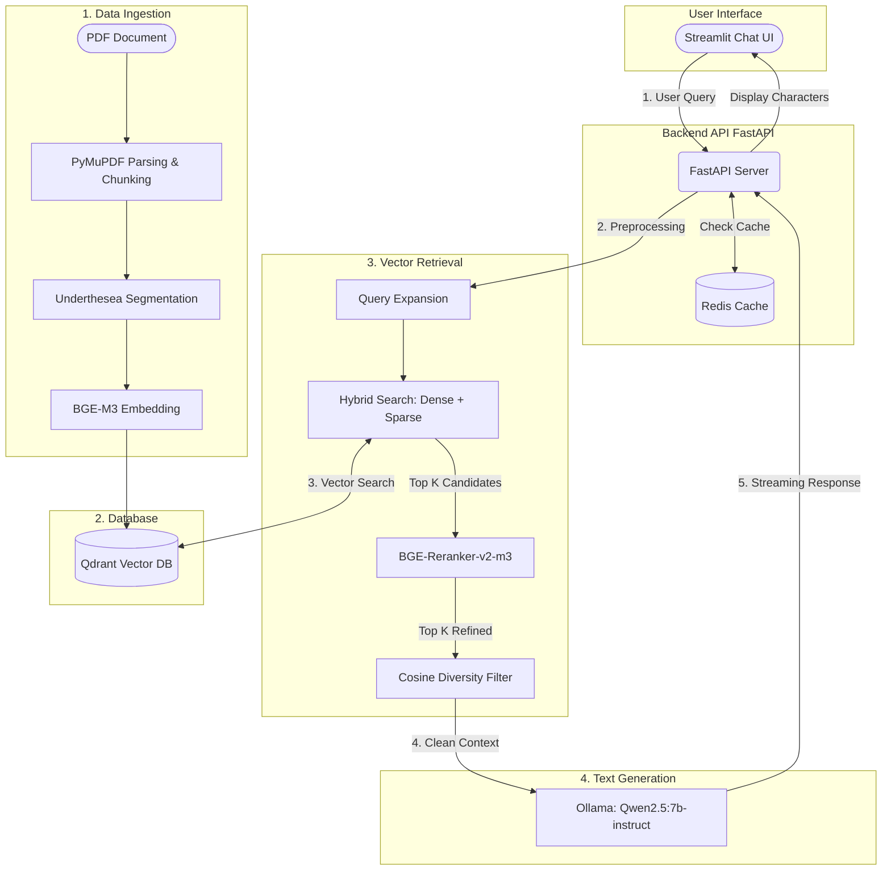

# 🇻🇳 Vietnamese RAG System (Production-Ready)


> Hệ thống Retrieval-Augmented Generation (RAG) chuyên biệt cho tiếng Việt, hướng tới môi trường production. 
> 
> **Dự án tham gia cuộc thi AI-Guru: Truy hồi và Hỏi đáp Văn bản Pháp luật Tiếng Việt**
> 
> Hệ thống được thiết kế để hỗ trợ tra cứu các điều khoản trong Luật Doanh nghiệp, đưa ra tư vấn pháp lý sơ bộ và trích dẫn nguồn văn bản chính xác dành cho các doanh nghiệp SME tại Việt Nam. Tuân thủ nghiêm ngặt quy chế cuộc thi: KHÔNG sử dụng API đóng (như GPT-4, Gemini) và giới hạn sử dụng mô hình LLM mã nguồn mở nội bộ (Local LLM) dưới 14B tham số.

---

## 1. Kiến trúc Hệ thống (System Architecture)

Hệ thống được thiết kế theo mô hình **Tách biệt (Decoupled)** giữa Frontend (Streamlit) và Backend (FastAPI). Kiến trúc này giúp dễ dàng mở rộng, tích hợp cache và đảm bảo tốc độ phản hồi (Streaming) mượt mà cho người dùng.

### Sơ đồ Luồng xử lý (Workflow)



### Các thành phần cốt lõi:
1. **Tiền xử lý (Ingestion):** Đọc PDF bằng `PyMuPDF`, cắt đoạn (chunking), tách từ tiếng Việt bằng `underthesea`, và nhúng (embedding) văn bản thành vector bằng `BGE-M3`.
2. **Tìm kiếm Lai (Hybrid Search):** Kết hợp cả Dense Vector và Sparse Vector (BM25) trên **Qdrant**, sử dụng thuật toán RRF để gộp kết quả.
3. **Xếp hạng lại (Reranking):** Dùng `BGE-Reranker` để chấm điểm lại các văn bản tìm được, lọc bỏ nhiễu và các đoạn trùng lặp ngữ nghĩa (Diversity Filter).
4. **Sinh đáp án (Generation):** Truyền ngữ cảnh chuẩn xác nhất vào Local LLM (`Qwen2.5:7b`) thông qua **Ollama** để sinh câu trả lời tự nhiên.
5. **Giao diện (Streamlit):** Cung cấp UI trò chuyện thời gian thực, quản lý file PDF tải lên và render quá trình streaming.

---

## 2. Hướng dẫn Chạy Dự án Chi tiết

Để chạy hệ thống chuẩn xác, máy tính của bạn cần được cài đặt sẵn:
- **Python 3.12+** (Khuyên dùng trình quản lý gói `uv`)
- **Docker** (Để chạy Qdrant và Redis)
- **Ollama** (Để chạy mô hình ngôn ngữ cục bộ)

### Bước 1: Cài đặt các gói thư viện (Dependencies)
```bash
# Di chuyển vào thư mục dự án
cd vietnamese-rag-system

# Cài đặt môi trường bằng uv (sẽ tự động đọc từ uv.lock / pyproject.toml)
uv sync
```

### Bước 2: Khởi động các dịch vụ nền (Database & Cache)
Đảm bảo **Docker** đang chạy trên máy, sau đó mở Terminal chạy các lệnh sau:
```bash
# Khởi động cơ sở dữ liệu Vector Qdrant qua file compose có sẵn
docker compose up -d

# Khởi động bộ nhớ đệm Redis
docker run -d -p 6379:6379 redis
```

### Bước 3: Chuẩn bị mô hình LLM (Ollama)
Cài đặt Ollama từ [trang chủ](https://ollama.com/), sau đó tải mô hình `Qwen2.5`:
```bash
ollama pull qwen2.5:7b-instruct
```

### Bước 4: Cấu hình biến môi trường
Tạo một file `.env` ở thư mục gốc của dự án (`vietnamese-rag-system/.env`) và điền các thông tin sau:
```env
QDRANT_HOST="localhost"
QDRANT_PORT=6333
REDIS_URL="redis://localhost:6379"
OLLAMA_BASE_URL="http://localhost:11434/api/chat"
LLM_MODEL_NAME="qwen2.5:7b-instruct"
```

### Bước 5: Chạy hệ thống RAG (Gồm 2 Terminal)
Vì dự án áp dụng kiến trúc tách biệt, bạn cần mở **2 cửa sổ Terminal** riêng biệt:

**Terminal 1: Khởi động Backend (FastAPI)**
```bash
uv run uvicorn src.api.main:app --host 0.0.0.0 --port 8000
```
*(Đợi đến khi thấy dòng `Application startup complete`)*

**Terminal 2: Khởi động Frontend (Streamlit)**
```bash
uv run streamlit run src/ui/streamlit_app.py
```
*(Trình duyệt sẽ tự động mở giao diện ứng dụng tại `http://localhost:8501`. Tại đây bạn có thể tải file PDF lên và trò chuyện)*

---

## 3. Tạo file nộp bài cho cuộc thi AI-Guru

Dự án có sẵn script tự động hóa toàn bộ việc đọc tập test, chạy RAG pipeline và xuất ra định dạng `submission.zip` nộp cho Ban Tổ Chức cuộc thi.

Để chạy script sinh kết quả:
```bash
uv run generate_submission.py --dataset "R2AIStage1DATA.json" --output "results.json" --collection "Dataset_Hybrid_BGE_M3_BM25_V1"
```

- `--dataset`: Đường dẫn tới file câu hỏi của BTC (Ví dụ `R2AIStage1DATA.json`).
- `--output`: Tên file json kết quả. Script sẽ tự động gom file này lại thành `submission.zip`.
- `--collection`: Tên collection trong Qdrant lưu trữ Database.

*(Lưu ý: Quá trình này có thể tốn thời gian. Script có hỗ trợ **Checkpoint tự động**, nếu bị ngắt ngang, bạn chỉ cần chạy lại đúng câu lệnh trên, hệ thống sẽ tự động chạy tiếp từ câu chưa làm.)*

---

## 4. Công nghệ sử dụng (Tech Stack)

- **Backend:** `FastAPI`, Python `asyncio`
- **Frontend:** `Streamlit`
- **Vector Database:** `Qdrant` (Async Client)
- **Caching:** `Redis`
- **Models AI:**
  - Embedding: `BAAI/bge-m3`
  - Reranking: `BAAI/bge-reranker-v2-m3`
  - LLM: `Qwen2.5:7b-instruct` (Ollama)
- **Xử lý tiếng Việt (NLP):** `underthesea`

## 5. Tác giả

**Ngô Văn Phước**  
Email: [24280401@student.hcmus.edu.vn](mailto:24280401@student.hcmus.edu.vn)